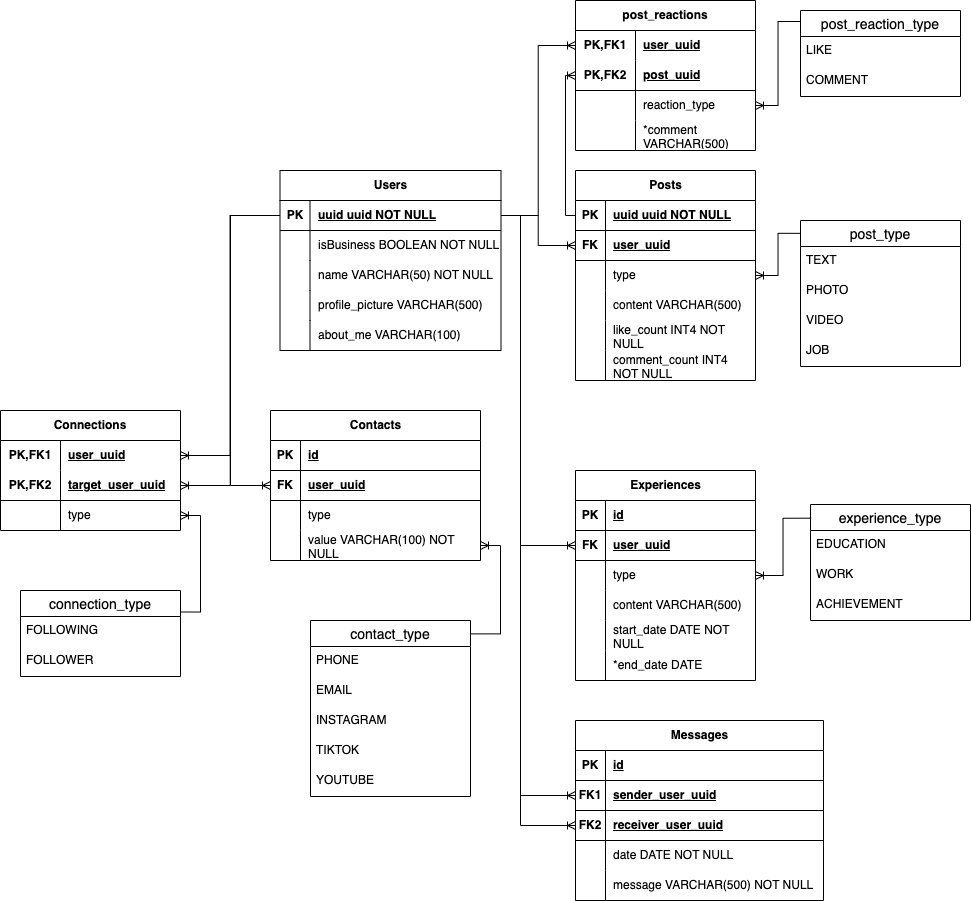
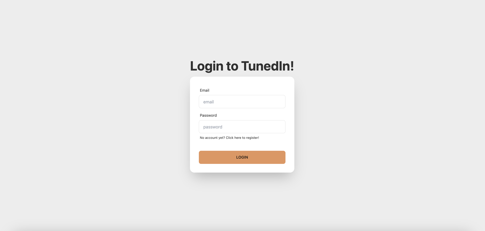
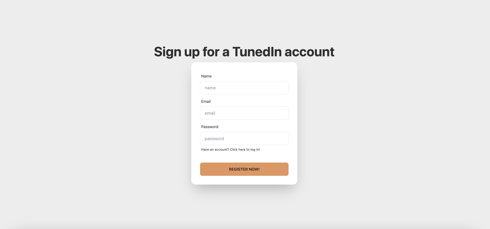
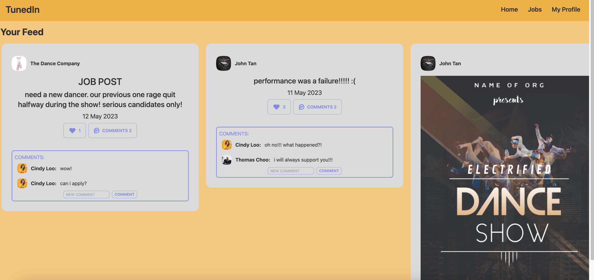
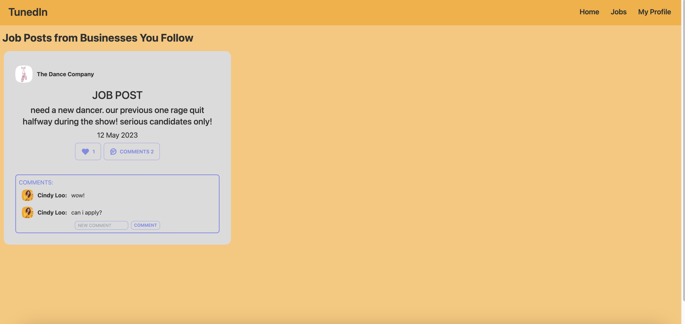
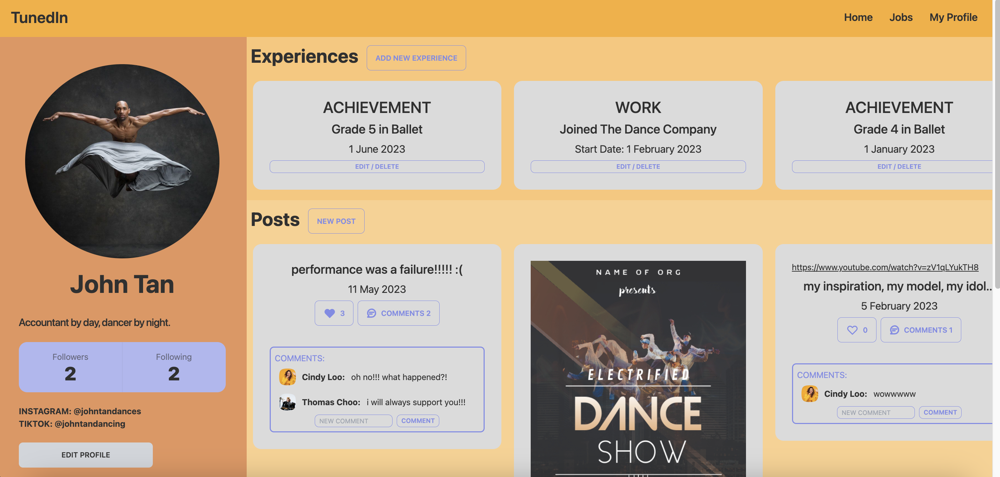
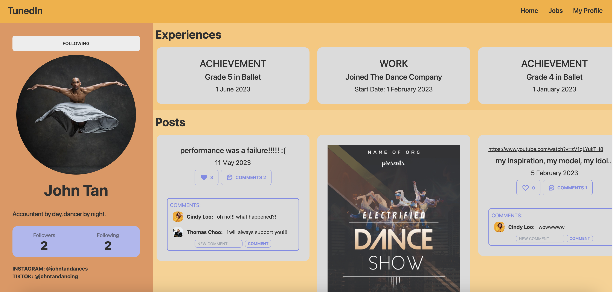
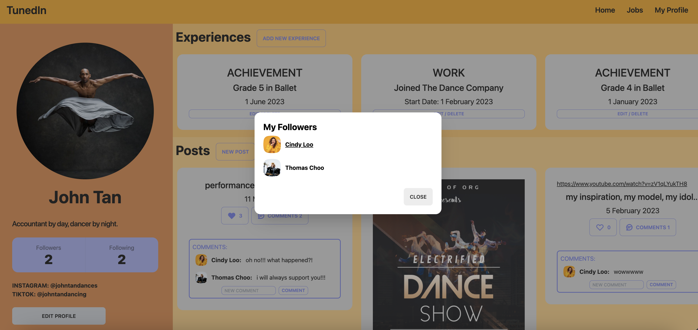

# TunedIn

## Overview

TunedIn is a social media app aimed at creatives who can showcase their talents, achievements, and more. Users can follow each other, populate their portfolio, and create posts. Users can interact on one another's posts by liking and commenting. Users can also use this platform to seek jobs or find talents to hire.

There are mainly 2 types of accounts: Personal and Business.
Business accounts have the additional option of post type - jobs.

## Technologies Used

- React.js
- PostgreSQL
- Django
- React
- Node
- Tailwind CSS

## ERD

## App Walkthrough

login page:

registration page:

home page: users will see their feed, comprising of posts from people and businesses they follow. likes and comments are updated live. all names (on posts and comments and followers/following are click-able and will bring you to the profile page of that user/business you clicked on.)

jobs page: users will see job postings from businesses they follow.

profile page (self): your own profile page, you can edit and delete your info and experiences and posts.

profile page (others): someone else's profile page, you can see their experiences and posts, and see whether you are following them or not. you are not able to edit or delete their stuff.

followers/following: clicking on the followers/following boxes will return a list of the followers/following and from there you can click their name to navigate to their profile.

